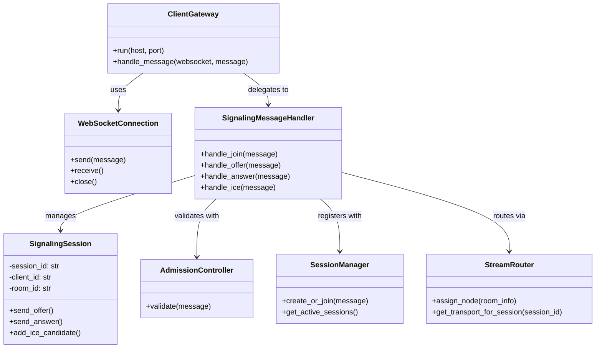

The system is organized around a SignalingRouter that directs incoming messages to specialized handlers. SessionHandler manages user presence and room membership. ProducerHandler and ConsumerHandler handle the setup and control of media streams. TransportHandler manages the WebRTC handshake including SDP and ICE. MediaControlHandler supports runtime media actions like mute/unmute and quality stats. Administrative controls like kicking users or locking rooms are handled by RoomAdminHandler. DiagnosticsHandler provides debugging and testing tools, while AuthHandler manages authentication and token lifecycle.


```
classDiagram
    class SignalingRouter {
        +route(message: dict)
    }

    class SessionHandler {
        +join()
        +leave()
        +disconnect()
        +heartbeat()
        +roomInfo()
    }

    class ProducerHandler {
        +createProducer()
        +closeProducer()
        +pauseProducer()
        +resumeProducer()
        +replaceTrack()
        +changeEncoding()
    }

    class ConsumerHandler {
        +createConsumer()
        +closeConsumer()
        +pauseConsumer()
        +resumeConsumer()
        +preferredLayers()
    }

    class TransportHandler {
        +sdpOffer()
        +sdpAnswer()
        +iceCandidate()
        +iceRestart()
        +connectTransport()
    }

    class MediaControlHandler {
        +mute()
        +unmute()
        +networkQuality()
        +videoStats()
        +audioStats()
        +mediaError()
    }

    class RoomAdminHandler {
        +lockRoom()
        +unlockRoom()
        +kickUser()
        +setRole()
    }

    class DiagnosticsHandler {
        +debugPing()
        +traceEvent()
        +chaosInject()
    }

    class AuthHandler {
        +auth()
        +validateToken()
        +refreshToken()
    }

    SignalingRouter --> SessionHandler
    SignalingRouter --> ProducerHandler
    SignalingRouter --> ConsumerHandler
    SignalingRouter --> TransportHandler
    SignalingRouter --> MediaControlHandler
    SignalingRouter --> RoomAdminHandler
    SignalingRouter --> DiagnosticsHandler
    SignalingRouter --> AuthHandler
```

The system centers around a ClientGateway, which listens for incoming WebSocket connections and delegates signaling messages. It uses a WebSocketConnection to send and receive messages from clients. All signaling interactions are handled by the SignalingMessageHandler, which interprets messages like join, offer, answer, and ICE candidates. The SignalingMessageHandler works with several backend components: SignalingSession manages per-client session data and signaling state; AdmissionController is responsible for validating whether messages or users meet criteria to proceed; and SessionManager handles room creation and active session tracking. To support media routing, StreamRouter assigns appropriate SFU or media nodes and provides transport details tied to session IDs. Together, these components form the signaling layer that coordinates connection setup between clients in real time.





```
classDiagram
    class Node {
        - node_id: str
        - incarnation: int
        - status: str
        - last_heartbeat: float
        + heartbeat()
        + __repr__()
    }

    class MembershipTable {
        - self_node_id: str
        - members: Dict[str, Tuple[int, str, float]]
        + update(node_id, incarnation, status)
        + merge(incoming_table)
        + snapshot()
        + __repr__()
    }

    class ProductionNode {
        - name: str
        - node_id: str
        - incarnation: int
        - status: str
        - membership: MembershipTable
        + update_status(new_status: str)
        + gossip_to(other_node: ProductionNode)
        + print_membership()
    }

    class GossipStrategy {
        + select_peer(node_list: List)
    }

    class Cluster {
        - nodes: List[ProductionNode]
        - strategy: GossipStrategy
        + add_node(node: ProductionNode)
        + remove_node(node: ProductionNode)
        + gossip_round()
        + print_all_memberships()
    }

    Node <|-- ProductionNode
    ProductionNode --> MembershipTable
    Cluster --> ProductionNode
    Cluster --> GossipStrategy
    class MetricsTracker {
        +Dict gossip_counts
        +Dict heartbeat_times
        +Dict failure_suspicions
        +record_gossip(sender_id, receiver_id)
        +record_heartbeat(node_id)
        +record_suspicion(node_id)
        +get_summary()
    }

    class DiagnosticTool {
        +MetricsTracker metrics
        +report_gossip_activity()
        +report_failures()
        +report_heartbeat_health()
    }

    class ProductionNode {
        +MetricsTracker metrics
        +send_gossip()
        +receive_gossip()
        +heartbeat()
    }

    ProductionNode --> MetricsTracker : logs to
    DiagnosticTool --> MetricsTracker : analyzes
    class Transport {
        +send(to_node_id: str, payload: dict)
        +receive(from_node_id: str) dict
    }
    ProductionNode --> Transport : uses
        class FailureDetector {
        +record_heartbeat(node_id: str)
        +check_suspicion(node_id: str): bool
    }
    ProductionNode --> FailureDetector : monitors

        class ClusterManager {
        +join(node: Node)
        +leave(node_id: str)
        +broadcast_change()
    }
    Cluster --> ClusterManager : orchestrates

        class StateStore {
        +save_membership()
        +load_state()
    }
    MembershipTable --> StateStore : persists
        class BootstrapConfig {
        +get_seed_nodes(): List[str]
        +get_gossip_interval(): int
    }
    Cluster --> BootstrapConfig : reads from

        class GossipMessage {
        +sender_id: str
        +membership_snapshot: dict
        +signature: str
    }
    Transport --> GossipMessage
        class FanoutStrategy {
        +select_targets(nodes: List[Node], k: int): List[Node]
    }
    GossipStrategy --> FanoutStrategy : delegates

        class KeyManager {
        +get_private_key(): str
        +verify_signature(data, signature): bool
    }
    ProductionNode --> KeyManager : uses for signing

        class GossipEnvelope {
        +type: str
        +payload: dict
        +signature: str
    }
        class GossipBackoff {
        +should_send(to_node_id): bool
    }

    class MessageCache {
        +is_duplicate(msg_id): bool
        +track(msg_id)
    }

    GossipStrategy --> GossipBackoff
    Transport --> MessageCache

        class MetricsExporter {
        +export()
    }

    DiagnosticTool --> MetricsExporter : emits metrics

        class BroadcastBuffer {
        +add_change()
        +next_batch()
    }

    ProductionNode --> BroadcastBuffer
        class WriteAheadLog {
        +append(change)
        +replay()
    }

    MembershipTable --> WriteAheadLog

        class NodeMetadata {
        +region: str
        +zone: str
    }

    ProductionNode --> NodeMetadata


```